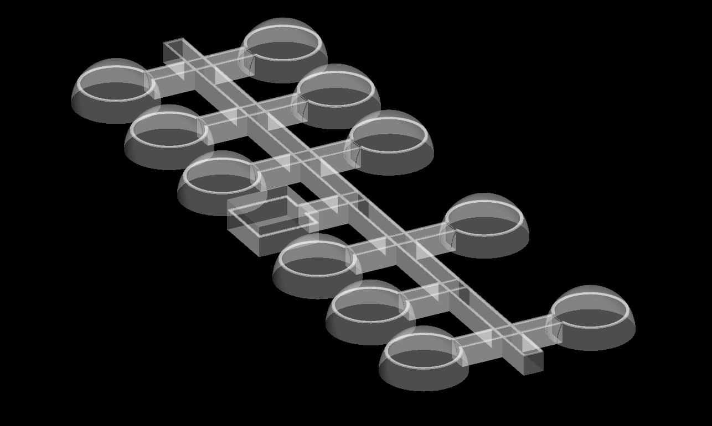
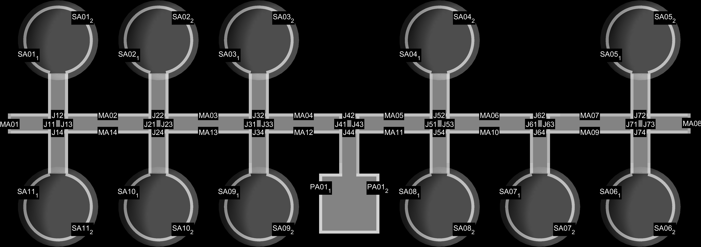
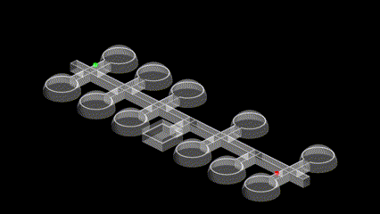
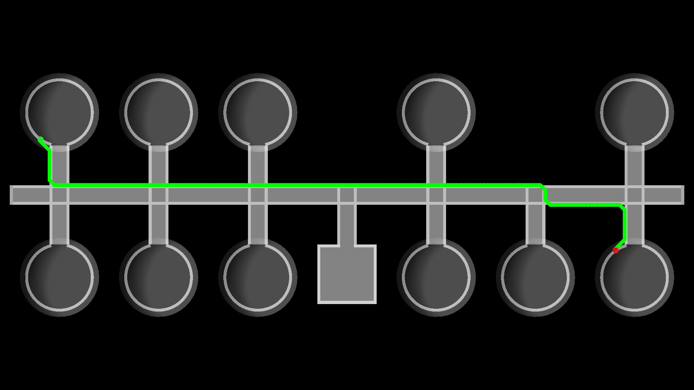
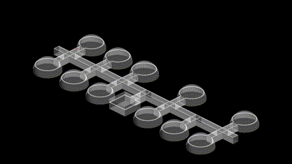
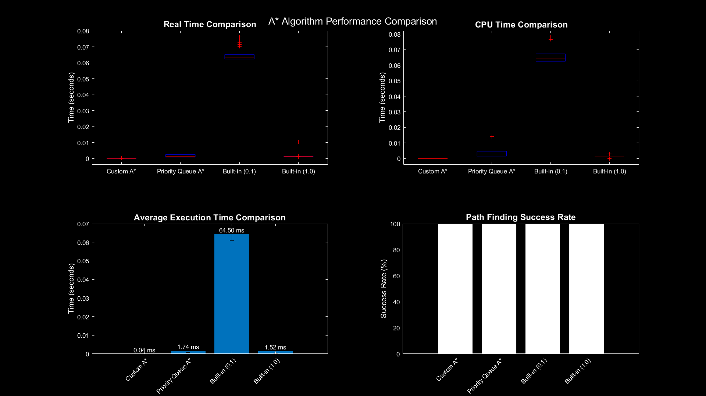

# **Path Planning Algorithms for Lunar Base Operations**

This project is part of a larger multi-robot coordination system for lunar base operations and warehouse management. The current focus is on developing and benchmarking efficient path planning algorithms for a segmented lunar base map. The main goals are:

1. Implement and compare three different path planning algorithms
2. Propose segmented map data storage for realtime pat planning
3. Lay groundwork for future collision avoidance implementation


---

## **Motivation**

Establishing and maintaining a lunar base involves numerous challenges, including navigation in constrained environments. Robots operating in such environments require efficient path planning algorithms to better Traffic Flow Optimization and ensure smooth coordination while maintaining precise navigation. This project addresses these needs by developing and benchmarking path planning approaches tailored to the lunar base's unique constraints.

---

## **Features**

- **Path Planning**:
   - Greedy heuristics segmented Algorithm: An optimized implementation of A* with heuristics adapted for the lunar environment and segmented map structure
   - Rail Segment A* Algorithm: Implemented the A* algorithm for the segemented map data instead of binary grid map
   - Built-in MATLAB A* Algorithm: Utilizing MATLAB's in-built A* implementation for benchmarking

- **3D Lunar Base Map Creation**:
   - Generated using 3D visualization tools to represent rail-based paths and modular super-adobe structures
   - Includes binary occupancy maps derived from the 3D map
   - Segmented map structure for improved computational efficiency

- **Benchmarking and Visualization**:
   - Comparative analysis of execution times and path lengths
   - Visualization of paths on binary occupancy map and 3D environment
   - Rover simulation along generated paths

- **Scalability**:
  - Modular design allows integration with future collision avoidance and task scheduling algorithms

---

## **Technical Approach**

### **Map Creation and Evolution**
**Initial Approach**:
   The project's initial approach utilized a static 2D map created in SolidWorks and imported into MATLAB for preliminary testing and proof of concept. The schematic features SuperAdobe structures (circles) connected by rail networks (lines) and junction blocks (squares), providing a simplified representation of the lunar base layout. While this design established the foundation for path planning algorithms, its limitations became apparent: the map was difficult to modify, its static nature restricted dynamic operations, and it offered limited flexibility for testing different configurations. These constraints ultimately led to the development of a more dynamic 3D implementation.

<div align="center">  <p align="center"> <em>2D schematic of lunar base rail network layout</em> </p> </div>

**Current Implementation**:
  The current implementation features a fully programmatic 3D map generation in MATLAB with modular and interconnected paths. The system comprises super-adobe structures (SA) with rail-based paths, main pathways connecting different sections, and junction points for path intersections, all controlled through user-configurable parameters for easy modification.
  
  <div align="center">  <p align="center"> <em>3D schematic of the above 2D lunar base</em> </p> </div>

**Core Implementation**: The map generation utilizes a structured approach where each component (SuperAdobe chambers, main paths, and connecting segments) is created through specialized functions. The system employs meshgrid for surface generation and implements sophisticated lighting for realistic visualization. Key features include:
   - Modular construction using mesh objects for structures and paths
   - Configurable parameters for dimensions, opacity, and lighting
   - Automated path coordinate generation with tangent vectors
   - Hierarchical organization of components
   - Users can modify the base layout through adjustable parameters
   - The entire map is also scalable to more intricate complex 3d map

**Innovative Path Connection Strategy**:
- Implemented directional connections to minimize branches and optimize path planning:
  - Super-adobe structures (SA) → Main paths (one-way connections)
  - Main paths → Super-adobe structures (no connection)
  - Removal of redundant SA connections from MA and J nodes
  - One-way connections from SA to MA/J nodes

<div align="center">  <p align="center"> <em>3D schematic of lunar base rail network layout with connection labels</em> </p> </div>

- **Benefits**:
  - Preservation of path completeness while reducing search space
  - Prevents loops from the circular path dependencies
  - Reduces computational complexity during path planning
  - Optimizes search space for the A* algorithm

**Map Parameters**:
- Dimensions: 30x70 units
- Robot step size: 0.1x0.1 unit
- Visualization using MATLAB's patch objects


#### Map Data Structure:
```matlab
paths = Dictionary() containing:
- connections: Adjacent path segments
- coordinates: [n×3] array of path coordinates
- tangents: [n×3] array of path tangent vectors
- headings: Path direction indicators
- start_point: [x, y, z] coordinates
- end_point: [x, y, z] coordinates
- distance: Path segment length
```

**Junction Design**

- The project explored multiple design iterations for junction mechanisms and side-wall climbing solutions, culminating in a comprehensive trade study of five distinct approaches. The selected T-junction configuration demonstrates efficient path transitions through a compact extending rail mechanism. The design was prototyped using an Endura 3D printer with PVC material and UltiMaker Cura slicing software, ensuring precise manufacturing tolerances and optimal print parameters for functional validation.

- The design exploration included static, mobile, magnetic, rotating, and extending rail configurations in SolidWorks, each evaluated for the lunar base's unique requirements. The extending rail design was selected and prototyped for its minimal moving parts, compact form factor, and reliable transition mechanism.

<div align="center">  <p align="center"> <em>Demonstration of extending rail junction mechanism showing transition between main rail and branch path. The T-junction design features compact extending segments (cyan) that enable smooth path switching.</em> </p> </div>

**Design Studies and Validation**

- A detailed trade study evaluated all variants across critical parameters including setup complexity, space utilization, structural stability, and failure modes. The study, supported by comprehensive SolidWorks models and simulations, demonstrates each design's mechanical feasibility within the pressurized lunar environment. For those interested in the complete design process, including detailed CAD models, trade studies, and mechanical analyses, I encourage reviewing my [comprehensive presentation](https://docs.google.com/presentation/d/1dFwunILNPZTwwPv7HNrZGY5GEilcVW4LtZWf2WEUo2U/edit?usp=sharing)
 that covers pressurized chamber optimization, sidewall climb mechanisms for inverted robots, and junction designs.

- The successful 3D printing implementation, using professional-grade manufacturing tools and software, validated the design considerations while providing crucial insights into manufacturing constraints and assembly requirements. This practical validation strengthened the overall system design and confirmed its suitability for lunar operations.

### **Path Planning Algorithm**
- **Greedy heuristics segmented Algorithm**:
   - Our custom A* algorithm is optimized for the lunar base's segmented path structure, utilizing several key optimizations:
   - #### Key Optimizations:
      - Uses mid-points instead of endpoints for heuristic calculations to reduce computational overhead
      - Implements Manhattan distance heuristic to match the grid-based movement constraints
      - Leverages segment-based navigation (66 segments) vs. grid-based approach (2100 grids)
   - #### Pseudocode:
```
    final_path[path_idx] = start_node
    current_node = start_node
    
    while true:
        // Get neighboring segments
        neighbours = paths[current_node].connections
        scores = zeros(length(neighbours))
        
        // Calculate Manhattan distance scores using mid-points
        for each neighbor in neighbours:
            scores[i] = manhattan_distance(paths[neighbor].mid_point, end_coords)
        
        // Select best neighbor
        current_node = neighbours[min(scores)]
        final_path[++path_idx] = current_node
        
        // Check termination condition
        if distance_to_goal < threshold:
            break
            
    return final_path[1:path_idx]
```

<div align="center">  <p align="center"> <em>Path planning based on the above Greedy heuristics algorithm, showing the planned route (red line) between SuperAdobe structures with waypoints overlaid on the 3D lunar base model.</em> </p> </div>

- **Rail Segment Astar Algorithm**:
   - This version uses the A* algorithm with a priority queue data structure for the segmented map.
   - #### Key Optimizations:
      - Uses mid-points instead of endpoints for heuristic calculations to reduce computational overhead
      - Implements Manhattan distance heuristic to match the grid-based movement constraints
      - Leverages segment-based navigation (66 segments) vs. grid-based approach (2100 grids)
   - #### Pseudocode:
```
    // Initialize data structures
    g_score = inf(n_nodes)
    f_score = inf(n_nodes)
    came_from = zeros(n_nodes)
    
    // Setup start node
    g_score[start_idx] = 0
    f_score[start_idx] = manhattan_distance(paths[start_node].end_point,paths[end_node].start_point)
    
    // Initialize priority queue
    open_set = PriorityQueue()
    open_set.insert(start_idx, f_score[start_idx])
    
    while !open_set.empty():
        current = open_set.pop()
        
        // Check goal condition
        if distance_to_goal < threshold:
            return reconstruct_path(came_from, current)
            
        // Process neighbors
        for neighbor in paths[current].connections:
            tentative_g = g_score[current] + paths[current].distance
            
            if tentative_g < g_score[neighbor]:
                // Update path
                came_from[neighbor] = current
                g_score[neighbor] = tentative_g
                f_score[neighbor] = tentative_g + manhattan_distance(paths[neighbor].mid_point, paths[end_node].start_point)
                open_set.insert(neighbor, f_score[neighbor])
                
    return null  // No path found
```
- **Built-in MATLAB Astar**:
   - Utilizes MATLAB's Navigation Toolbox for baseline comparison, operating on a full grid representation rather than segments.

   <div align="center">  <p align="center"> <em>Path planning using in-built A* function and binaryoccupancy map</em> </p> </div>
   
- **Key Implementation Notes:**:
   - Manhattan Distance Choice
      - Selected due to lunar base's orthogonal path structure
      - Perfectly matches vertical and horizontal movement constraints
      - Reduces computational complexity compared to Euclidean distance
   - Mid-point Optimization
      - Using mid-points instead of endpoints for heuristic calculations
      - Reduces computational overhead without significant impact on path quality
      - Particularly effective in segment-based approach
   - Segment-based Navigation
      - Reduces decision space from 2100 grids to 66 segments
      - Each segment contains pre-computed connectivity information
      - Significantly improves computational efficiency
---

### **Rover Simulation**

**Implementation Details**
- Rover modeled as a cuboid with dimensions:
  - Length: 0.5m
  - Width: 0.4m
  - Height: 0.2m
- Visualization using MATLAB's patch objects for 3D rendering

<div align="center">  <p align="center"> <em>Path execution visualization showing a simulated rover (red cuboid object) traversing the generated path from start to goal location.</em> </p> </div>

**Path Following Mechanics**
- Utilizes pre-computed tangent vectors stored in path data structure
- Smooth transitions achieved through:
  - Direct use of pre-computed path tangents for orientation
  - Automatic rotation calculation based on path direction
  - Position updates synchronized with orientation changes

**Key Features**
- Real-time visualization of rover movement along planned path
- Smooth transitions between path segments due to pre-computed tangent data
- Accurate representation of rover orientation using rotation matrices

**Implementation Benefits**
- Pre-computed tangent vectors eliminate need for runtime angle calculations
- Results in exceptionally smooth movement and natural-looking transitions
- Reduces computational overhead during simulation
- Enables realistic visualization of rover behavior on lunar base paths

---


### **Benchmarking and Results**

- Metrics: Execution time, path length, computational complexity
- Comparison of segment-based (66 segments, max 6 branches) vs. grid-based (2100 grids, 4 branches) approaches
- Performance analysis at different resolutions (1x1 and 0.1x0.1 grid sizes)

**Methodology**
- Number of test cases: 50 random start-end pairs
- Number of runs per pair: 10 runs
- Two resolution settings tested: 0.1 and 1.0
- Both real-time and CPU time measurements

**Performance Metrics**
- Execution time (real and CPU)
- Path length
- Success rate
- Statistical variance

**Visualization**

The comprehensive benchmarking approach ensures reliable performance comparison between the different path planning implementations.
| Algorithm | Avg. Execution Time (ms) | Feasible path success rate (%) | Computational Complexity |
|-----------|--------------------------|--------------------------|--------------------------|
| Greedy heuristics segmented Algorithm | 0.04                         | 100                         | O(n log n)               |
| Rail Segment A* Algorithm | 1.74                       | 100                         | O(n log n)               |
| Built-in A*(res 0.1) | 64.5                       | 100                         | O(n log n)               |
| Built-in A*(res 1) | 1.52                       | 100                         | O(n log n)               |


<div align="center">  <p align="center"> <em>Performance comparison of path planning algorithms showing: (top left) real-time execution comparison, (top right) CPU time comparison, (bottom left) average execution time in milliseconds, and (bottom right) path finding success rate.</em> </p> </div>

**Key Findings**
- The benchmarking results reveal significant performance differences between the implemented path planning approaches. The Custom A* (Greedy) algorithm demonstrates exceptional performance with an average execution time of just 0.04ms, making it ideal for real-time applications. The Rail Segment A* (Priority Queue) implementation achieves respectable performance at 1.74ms, while the built-in A* with 0.1 resolution requires 64.50ms. All algorithms maintain 100% path-finding success rates, validating their reliability.

- The built-in A* with 0.1 resolution, though computationally more intensive, is necessary for precise robot movement control, enabling velocities below 1 m/s and finer granularity in path execution. The 1.0 resolution variant was included purely for benchmarking purposes.

- Each algorithm offers distinct advantages: The Rail Segment A* provides universal applicability and extensibility to more complex lunar base layouts, leveraging classical A* principles for robust path planning. The Greedy approach, while optimized for the current layout, achieves remarkable efficiency by requiring only 4 decisions to determine the final path. Its exceptional runtime performance makes it particularly suitable for real-time collision avoidance implementations. While the Greedy algorithm shows promise for complex branched environments, this capability requires further validation through testing.

- The boxplots in both real-time and CPU time comparisons demonstrate consistent performance across multiple runs, with the Custom A* showing minimal variance, indicating reliable real-time operation. This stability, combined with its minimal computational overhead, makes it particularly valuable for dynamic path planning scenarios.

---

## **Impact**

This project had a profound impact on my academic and professional growth:
- **Academic Recognition**: 
  - Earned top project recognition in a peer-reviewed class evaluation.
- **Professional Development**: 
  - Helped secure a position at the Space Robotics Lab at the University of Arizona.
- **Personal Growth**: 
  - Reinforced my passion for robotics and control systems through hands-on application and dynamic simulations.

---

## **Future Work**
   - Collision Avoidance: Enhance algorithms for dynamic obstacles and multi-robot scenarios
   - Task Planning: Implement genetic algorithm for optimal task allocation and scheduling
   - Hardware Integration: Test algorithms on physical robots in simulated lunar environments
   - Performance Optimization: Further investigate and optimize Custom A* implementation to fully leverage reduced decision space in segmented approach


---

## **Try It Yourself**

### **Prerequisites**
- MATLAB with Simulink (R2022a or later).
- Robotics Toolbox for MATLAB.

### **Setup**
1. Clone the repository:
   ```bash
   git clone https://github.com/adharsh-prasad/Robotics-Portfolio/tree/main/Lunar_Operations_Task_Planning
   ```
2. Open MATLAB and navigate to the project directory
3. Run the main script to generate maps, execute algorithms, and visualize results

### **Customization**
Modify parameters in the script files to explore different scenarios:
- Map dimensions and resolution
- Rover dimensions and movement characteristics
- Algorithm-specific parameters

### **Acknowledgments**
This project is part of ongoing research to optimize robotic operations for lunar base construction and maintenance. 
