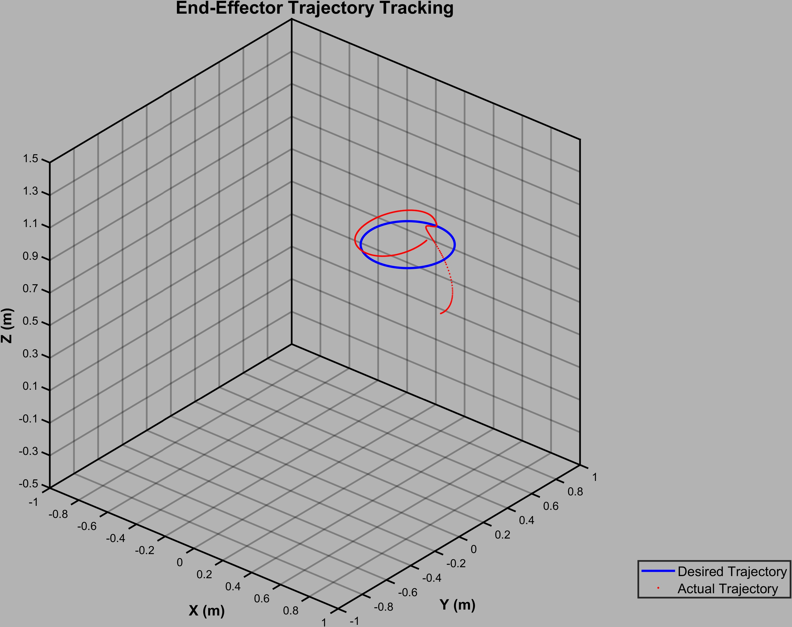
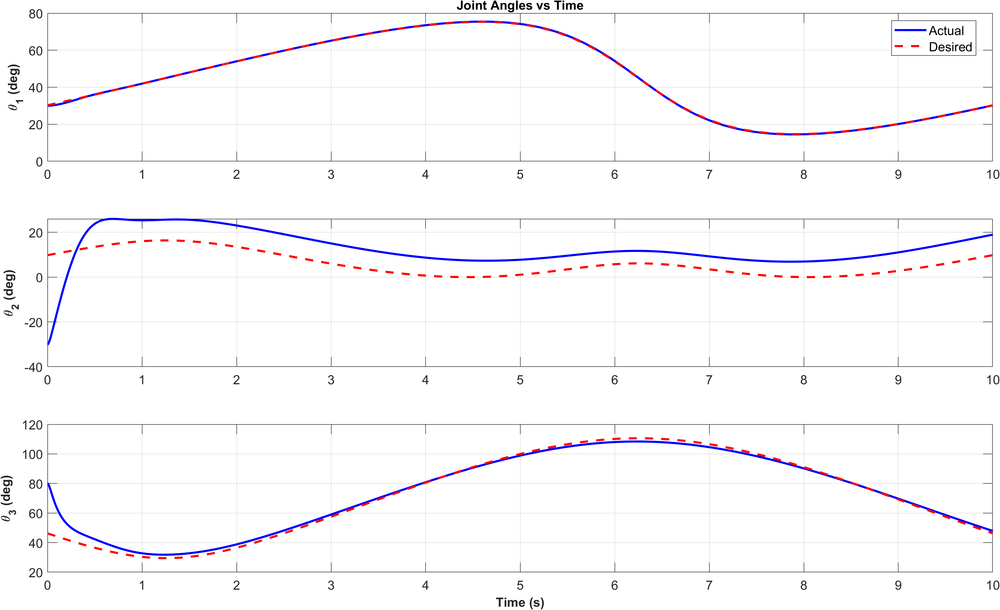
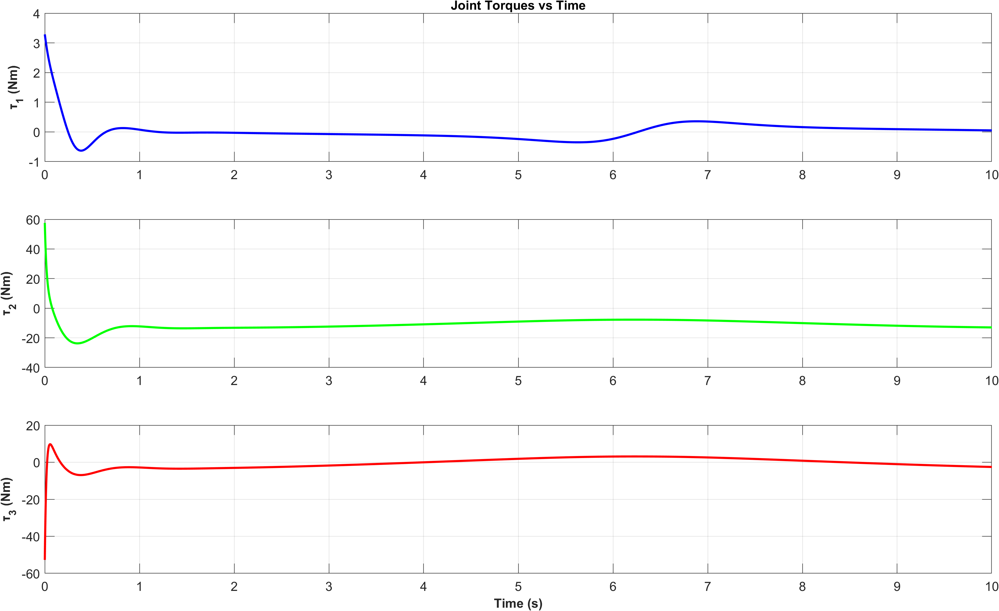
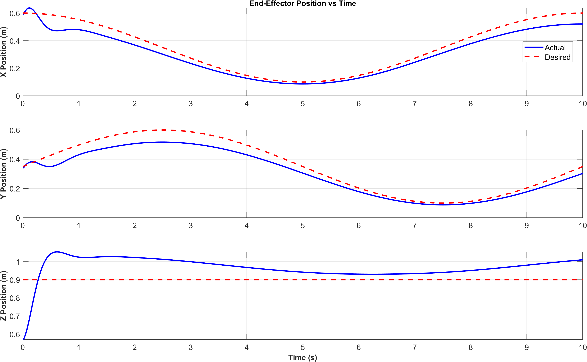

# **Trajectory Tracking Control of an Anthropomorphic Robotic Arm**

This repository contains the code and documentation for the **Trajectory Tracking Control of an Anthropomorphic Robotic Arm** project. The project showcases the integration of control theory, specifically a Proportional-Derivative (PD) controller, to achieve accurate trajectory tracking for a robotic arm. The simulation visualizes the arm's performance in tracking complex trajectories under varying conditions.

---

## **Motivation**


This project represents a significant milestone in my academic and personal journey. As a graduate student at Arizona State University (ASU), I sought to bridge my background in control systems with my interest in robotics. This project provided the perfect opportunity to merge these domains.

Notably, it was the only project in the class to fully integrate control theory, kinematic modeling, and dynamic simulation. The result was a peer-reviewed project that earned first place and opened doors for further research opportunities at the Space Robotics Lab.

---

## **Features**

- **Custom Kinematics**:
  - Forward kinematics using Denavit-Hartenberg (D-H) parameters.
  - Geometrically solved inverse kinematics for accurate joint configuration.

- **Trajectory Control**:
  - Designed and implemented a PD controller for precise trajectory tracking.
  - Tuned controller gains for zero steady-state error and minimal overshoot.

- **Simulation and Visualization**:
  - Comprehensive 3D simulation of trajectory tracking.
  - Robust performance demonstrated with disturbance torque simulations.

- **Optimization**:
  - Comparison between traditional tuning methods and Particle Swarm Optimization (PSO) for control parameter tuning.

---

## **Technical Approach**

### **Kinematic Model**
Forward and inverse kinematics were developed to enable precise motion planning:
- **Forward Kinematics**: 
  
  This provides the end-effector's position based on joint angles. The figure above illustrates the robot's reachable workspace.

- **Inverse Kinematics**:
  
  Solved geometrically, the inverse kinematics algorithm ensures that the robotic arm's joint angles achieve desired end-effector positions. The figure above demonstrates the end-effector following a circular trajectory.

### **Control System**
The PD controller ensures smooth and accurate trajectory tracking:
- **Proportional-Derivative Control**:
  A PD controller was designed to track the desired trajectory with high precision. The control law minimizes the error between desired and actual positions while ensuring stability.

  

- **Performance Testing**:
  Simulation results were validated using MATLAB. The plots above show the joint angles and velocities over time, highlighting the controller's smooth and accurate performance.

### **Disturbance Torque Simulation**
The robustness of the control system was tested by introducing disturbance torques, simulating real-world uncertainties.

  

The figure above illustrates the control torques applied to each joint, showcasing the PD controller's ability to counteract disturbances effectively.

---

## **Simulation and Results**

### **Trajectory Tracking**


The PD controller achieves excellent trajectory tracking, with minimal tracking errors as shown in the end-effector position tracking plots.

### **Robustness to Disturbances**
Even under disturbance conditions, the controller ensures the robotic arm follows the desired trajectory with negligible deviation. The disturbance torque and its effects are visualized in the control torque plots.

### **Singularity and Workspace Analysis**
Singularity analysis ensures safe motion planning within the robot's workspace. The workspace is visualized across multiple views:
- 
- 

These views depict the arm's reachable positions and highlight regions to avoid during trajectory planning.

---

## **Impact**

This project had a profound impact on my academic and professional growth:
- **Academic Recognition**: 
  - Earned top project recognition in a peer-reviewed class evaluation.
- **Professional Development**: 
  - Helped secure a position at the Space Robotics Lab at the University of Arizona.
- **Personal Growth**: 
  - Reinforced my passion for robotics and control systems through hands-on application and dynamic simulations.

---

## **Future Work**

1. **Optimization**:
   - Implementing Particle Swarm Optimization (PSO) for real-time controller parameter tuning.
2. **Expanded Applications**:
   - Extending the control system to multi-DOF robotic arms.
3. **Adaptive Control**:
   - Introducing adaptive controllers for better performance under uncertain conditions.

---

## **Installation and Usage**

### **Prerequisites**
- MATLAB with Simulink (R2022a or later).
- Robotics Toolbox for MATLAB.

### **Setup**
1. Clone the repository:
   ```bash
   git clone https://github.com/username/trajectory-tracking-robotic-arm.git
