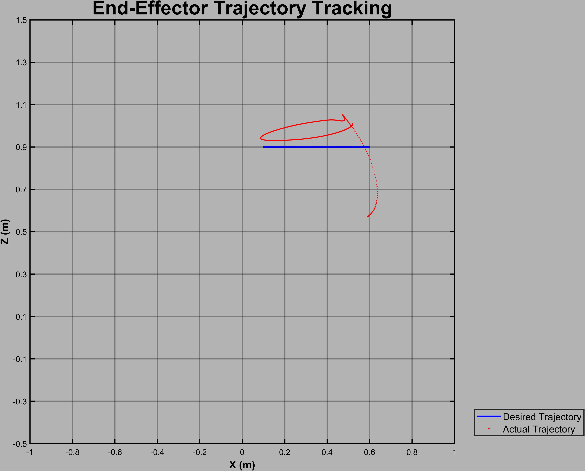
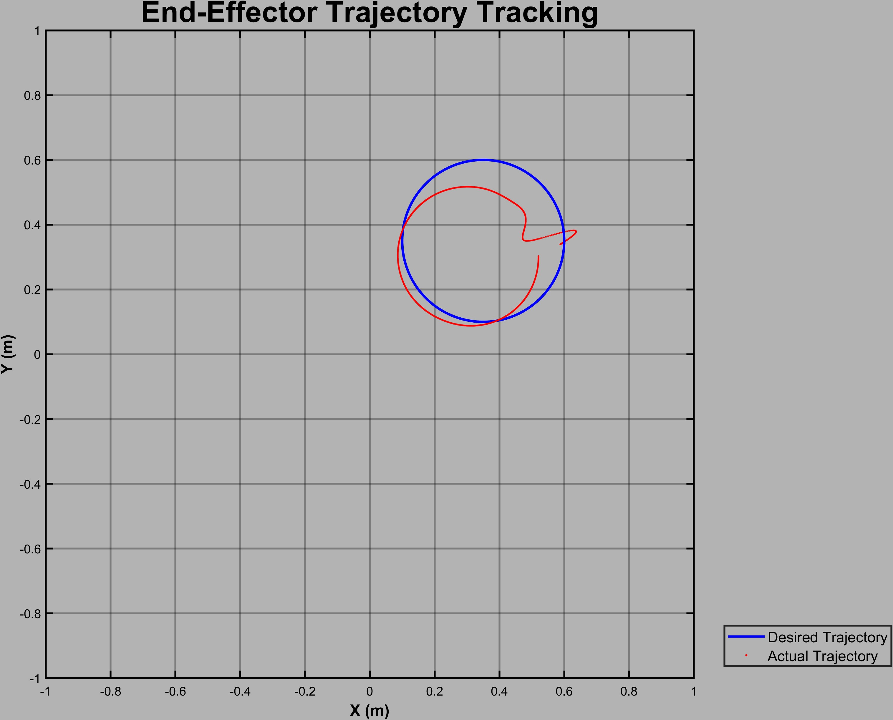

# Anthropomorphic Robotic Arm Trajectory Control

<div align="center">
  
  <p style="font-size: 12px; color: #8b949e; font-weight: 400;">Trajectory Control</p>
</div>

## Overview
Implementation of a PD controller for trajectory tracking of a 3-DOF anthropomorphic robotic arm. The project demonstrates complete arm dynamics modeling, custom inverse kinematics solution, and real-time trajectory control visualization.

## Technical Implementation

### Robotic Arm Configuration
- 3-DOF anthropomorphic configuration
- Custom geometric inverse kinematics solution
- Complete dynamic model including inertial, Coriolis, and gravitational effects
[Insert arm configuration image]

### Workspace Analysis
<div align="center">
  
  
  
</div>

### Control System Design
- PD control architecture with:
  - Position feedback control
  - Velocity damping
  - Gravity compensation
- Gains: Kp = diag([80, 80, 80]), Kd = diag([15, 15, 15])

### Performance Analysis
<div align="center">
  
  
</div>

Key metrics:
- Joint angle tracking accuracy
- End-effector position control
- Control effort optimization

## Results
- Successful trajectory tracking with minimal steady-state error
- Smooth control inputs across all joints
- Stable performance across workspace

## Technical Details

### Mathematical Foundation
- Forward kinematics using DH parameters
- Geometric inverse kinematics solution
- Dynamic model incorporating:
  - Inertial effects
  - Centripetal and Coriolis forces
  - Gravitational loading

### Implementation
```matlab
% PD Control Law
tau = Kp*e + Kd*ed;
```

## Project Impact
This project represents a significant milestone in combining classical control theory with modern robotics:
- First-place recognition in peer review evaluations
- Complete implementation from mathematical modeling to visualization
- Foundation for advanced space robotics applications

## Future Work
- Implementation of PSO-based gain optimization
- Addition of obstacle avoidance capabilities
- Extension to 6-DOF manipulation

## Tools Used
- MATLAB R2020a or newer
- Robotics Toolbox by Peter Corke
- Custom visualization framework

## Personal Note
This project marked my transition from control theory to practical robotics applications during my Masters at ASU. Its success opened doors to space robotics research, combining my interests in control systems and robotics.

## Author
Adharsh Prasad Natesan

## License
MIT License

This README combines technical depth with personal context, showcasing both the engineering achievement and its significance in your academic journey.
